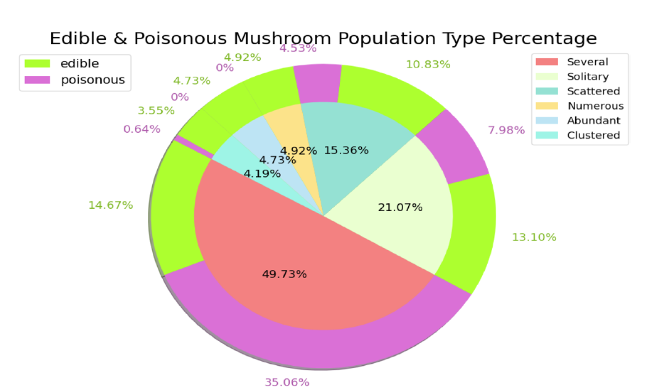
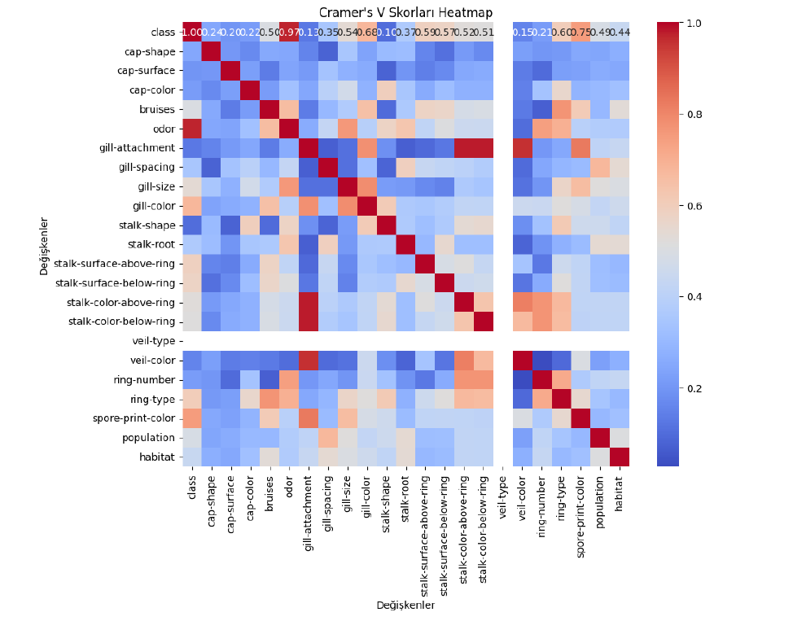
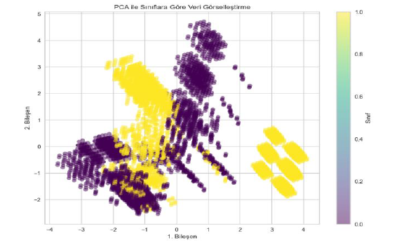
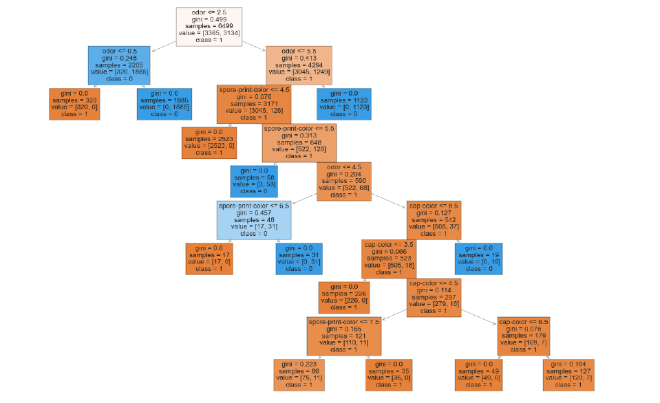

# 🍄 Mantar Sınıflandırması – Denetimli Makine Öğrenmesi

## 📌 Proje Özeti
Bu proje, UCI Mantar veri setini kullanarak mantarları **yenilebilir veya zehirli** olarak sınıflandırmak için denetimli makine öğrenmesi modelleri geliştirmektedir. İstatistiksel analizler ve ileri seviye makine öğrenmesi teknikleri ile %100'e yakın doğruluk hedeflenmiştir.

---

## 📊 Veri Seti ve Dağılım
Veri seti 8.124 gözlemden oluşmaktadır. Aşağıdaki grafik, mantar popülasyon tiplerinin yenilebilirlik durumuna göre dağılımını göstermektedir:

*Görselde görüldüğü üzere, "Several" (Çeşitli) popülasyon tipi verinin yaklaşık %50'sini oluştururken, zehirli mantarların büyük bir kısmı bu grupta toplanmıştır.*

---

## 🔎 Keşifsel Veri Analizi (EDA)
Değişkenler arasındaki kategorik ilişkileri belirlemek için **Cramer's V** skorları hesaplanmış ve ısı haritası oluşturulmuştur.

*Isı haritası, özellikle 'odor' (koku) ve 'gill-color' gibi özelliklerin hedef değişken (class) ile ne kadar güçlü bir ilişkiye sahip olduğunu kanıtlamaktadır.*

---

## ⚙️ Özellik Seçimi ve Boyut İndirgeme
22 farklı kategorik özellik, model karmaşıklığını azaltmak için analiz edilmiştir. **PCA (Temel Bileşenler Analizi)** ile veri 2 boyuta indirilerek sınıfların ayrışabilirliği görselleştirilmiştir.

*Sarı ve mor kümelerin net ayrımı, doğrusal olmayan modellerin bu veri setinde neden çok yüksek başarı elde ettiğini açıklamaktadır.*

---

## 🤖 Model Performansı ve Karar Mekanizması
Random Forest ve Karar Ağaçları gibi topluluk yöntemleri kullanılmıştır. Modelin karar verme süreci aşağıdaki şema ile şeffaflaştırılmıştır:

*Karar ağacı, 'odor' özelliğinin ilk ayrımda ne kadar kritik bir rol oynadığını doğrulamaktadır (Gini indeksi analizi).*

---

## 🛠 Kullanılan Teknolojiler
- **Kütüphaneler:** Python (Pandas, Scikit-learn, Yellowbrick, Mlxtend).
- **Analiz:** PCA, RFECV, Cramer's V, K-Means.
- **Modeller:** Random Forest, SVM, Logistic Regression, KNN.

---

## 📌 Sonuç
Proje sonucunda Random Forest modeli **%99.3** doğruluk elde etmiştir. Bu yüksek başarı oranı, doğru özellik seçimi ve veri setindeki sınıfların (yenilebilir/zehirli) belirgin fiziksel farklara sahip olmasıyla ilişkilendirilmiştir.
